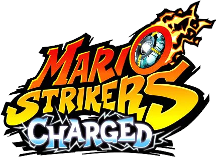

# Strikers Patch

Play **Mario Strikers Charged** (Wii) with a **GameCube controller** or a
**Classic Controller** instead of a Wii Remote and Nunchuk. Works with the USA
(`R4QE01`), both European revisions (`R4QP01`) and the Japanese (`R4QJ01`)
releases, and each patch is optional.

The patches are applied to your own copy of the game: drop a clean `.wbfs` or
`.iso` onto the patcher and play the result on a Wii (USB loader) or in
Dolphin. Nothing from the game is included in this repository.



## Status

Tested **only in Dolphin**, with scripted pad input. **Not tested on a real
Wii.** The Korean release is not covered (no dump was available).

- GameCube controller: no Wii Remote needed. Buttons and the control stick
  reach the game the same way a Classic Controller does. Verified in Dolphin
  (port 1) on the USA, both European and the Japanese release; the other ports
  use the same code but were not individually tested (see `tools/dev/`).
- Patched disc images were checked by extracting the result and comparing its
  `main.dol` with the directly patched one.
- Classic Controller: Vague Rant's codes, unchanged, in the same three formats.

**Known limits**

- plug the GameCube controllers in **before** starting the game; hot-plugging is
  best-effort
- the game's own menus that mention "Wii Remote" still say so
- behaviour in the HOME Menu and in every game mode has not been tested

## Controls

### GameCube controller

The pad is presented to the game as a Classic Controller. Z swaps items and L
modifies shots, using Vague Rant's Classic mapping with L and ZL swapped.

| GameCube | Classic Controller |
| --- | --- |
| Control stick | Left stick |
| C-stick | Right stick |
| A / B / X / Y | A / B / X / Y |
| Z | L |
| L | ZL |
| R | R |
| Start | + |
| D-pad | D-pad |
| L + R + Start | HOME |

## Installing

### Patch your disc image

You need a clean `.wbfs` or `.iso` of the game. Download the patcher for your
system from the releases page (or the artifacts of the latest CI run), or run it
from source (needs Python 3 with tkinter and
[Wiimms ISO Tool](https://wit.wiimm.de/) (`wit`) on your `PATH`):

```bash
python3 tools/gui.py
```

Tick the patches you want, then drop the image onto the window. The patcher
extracts the disc, recognises the release (the two European discs share an id
and are told apart by their `main.dol`), patches `sys/main.dol`, rebuilds the
image in the same format and replaces your file, keeping the original next to it
as `<name>.bak`. Other releases, and images already modified by something else,
are refused rather than corrupted.

Command line:

```bash
python3 tools/patch_disc.py "Mario Strikers Charged (USA).wbfs" --cc --gc
```

### Gecko codes (Dolphin)

Copy `codes/<region>.ini` into Dolphin's `GameSettings` folder (`R4QE01`,
`R4QP01_rev1`, `R4QP01_rev2` or `R4QJ01`; rename it to the disc id, e.g.
`R4QP01.ini`) and enable the codes under **Properties → Gecko Codes**. For the
GameCube controller set the ports to Standard Controller.

The same codes are in `codes/<region>.txt` in the plain layout loaders read. The
codes keep helper routines in low memory, where a loader's own code handler also
lives, so on a real console prefer the patched disc.

### Riivolution

`riivolution/<region>.xml` is a Riivolution patch with one switch per feature.
Riivolution matches on the disc id and version only, so for Europe pick the file
for your revision yourself.

### Which release do I have?

The disc id is the first six characters of the disc (`R4QE01` USA, `R4QP01`
Europe, `R4QJ01` Japan). The patcher reads it for you and, for Europe, tells
Rev 1 from Rev 2.

## Building from source

The patcher needs only Python 3 and `wit`. The routines it injects ship
pre-assembled in `tools/prebuilt/` (checked by `tools/check.py`); with
[devkitPPC](https://devkitpro.org/) and your own `main.dol` dumps you can
rebuild them from `src/`:

```bash
STRIKERS_DOLS=/dir/with/R4QE01.dol,R4QP01_rev1.dol,R4QP01_rev2.dol,R4QJ01.dol python3 tools/gen_prebuilt.py
python3 tools/build.py        # regenerate codes/ and riivolution/
python3 tools/check.py        # consistency checks (no game files needed)
STRIKERS_DOLS=... python3 tools/verify.py   # checks every patch against the retail DOLs
```

How the patches work is in [docs/TECHNICAL.md](docs/TECHNICAL.md).

## Credits

- **Vague Rant** — the Classic Controller hack (`src/cc/`), including the
  pointer emulation. These are his codes; this repository converts them into the
  same format as the other patch so they work in all three install methods.
- The Gecko / WiiRD community for the code format and code handler.

## Contact

quatricsoftware@gmail.com

No support will be provided for this tool.

## License

MIT — see [LICENSE](LICENSE).

Copyright (c) 2026 quatric
